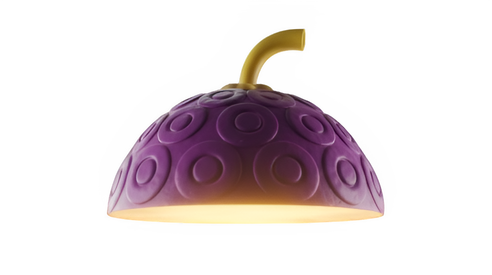

  

  

<h3 align="center">
  
</h3>

  

 

<h2 align="left">🚀 About Me</h2>

I'm a **B.Tech student specializing in Artificial Intelligence and Machine Learning**, passionate about building intelligent systems and scalable web applications. Based in India (UTC +05:30), I focus on combining AI with real-world problem solving to create impactful digital solutions.

- 🧠 Currently working on **Machine Learning & Deep Learning** projects
- 💻 Building **full-stack applications** with modern tech stacks
- 🔍 Exploring **Neural Networks, LLMs**, and AI-powered tools
- 🏆 Improving problem-solving skills through competitive coding
- ⚡ Fun fact: I debug life the same way I debug code — patiently and logically

 

  
  

    
🗺️ SEE MORE

     
    
     
    
    

     
    
  

  

 
<h2 align="center">🛠️ Tech Stack</h2>

  

---

 
  <i>Random Dev Joke for You! 🎭</i>  
  

 

<h2 align="center">💰 Pirate Bounty (GitHub Stats)</h2>

  

  

 

<h2 align="center">🐍 Contribution Quest</h2>

 

  <b>💻 Navigator of Code: FALAKKKJ © 2026</b>

